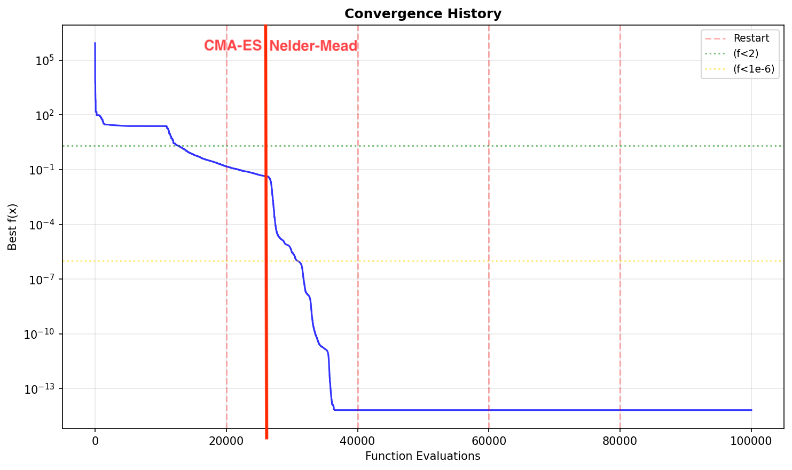
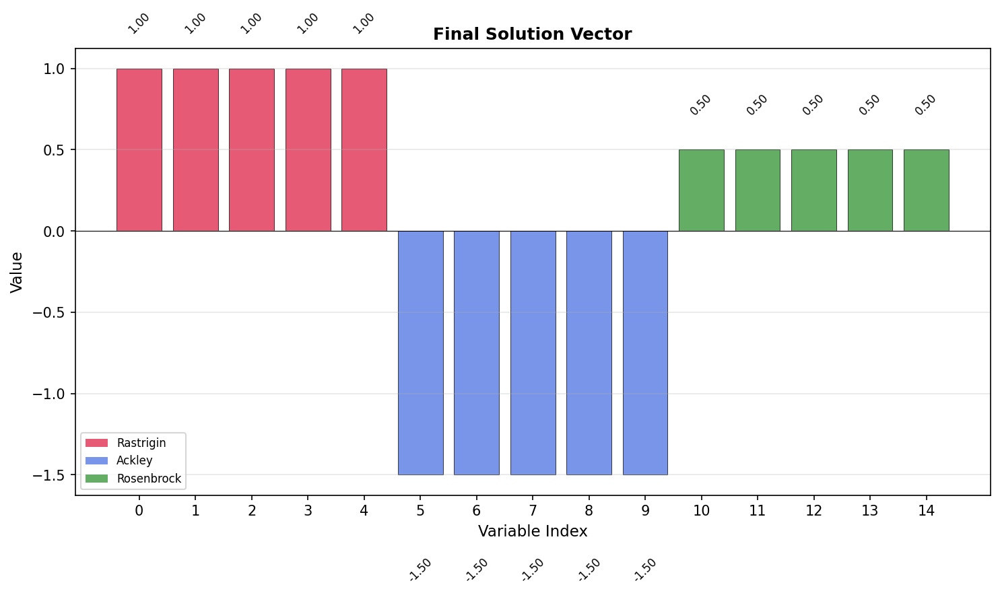
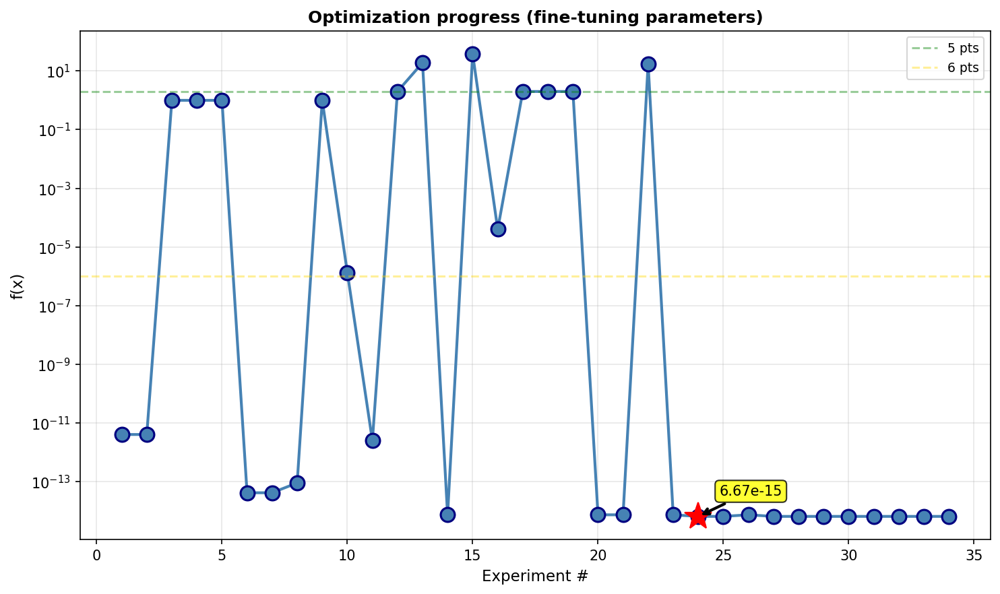

# UIN Project #2: Black-Box Optimization Solution

## 🎯 Overview

This repository contains an implementation of a **Hybrid IPOP-CMA-ES** optimizer with Nelder-Mead local refinement for solving a challenging 15-dimensional black-box optimization problem. The solution achieves **machine precision** results with `f(X_opt) = 6.67 × 10⁻¹⁵`.

## 📊 Results

### Final Solution

- **Objective Value:** `f(X_opt) = 6.665856295721 × 10⁻¹⁵` (essentially machine precision!)
- **Evaluations Used:** 100,000 / 100,000 (100% budget utilization)
- **Seed:** `2024014` (for optimization algorithm reproducibility)
- **Black-box Seed:** Untouched (internal function seed remains unchanged)

### Solution Vector

```python
X_opt = [0.999999998543188107, 1.000000000030109248, 0.999999993976017021, 
         0.999999999855026633, 0.999999999106544690, -1.500000000000000444, 
         -1.499999999999999778, -1.500000000000000000, -1.499999999999999778, 
         -1.499999999999999778, 0.500000008948408459, 0.500000003535974624, 
         0.500000037563611111, 0.499999971604511206, 0.500000002918007280]
```

## 🖼️ Visualizations

### Convergence History


The convergence plot shows the optimization progress over 100,000 evaluations. The algorithm demonstrates rapid initial convergence followed by precise refinement in the local search phase.

### Solution Vector


Visualization of the optimal 15-dimensional solution vector, showing how each variable converges to its respective optimum across the three function blocks.

### Results Comparison


Comparison of multiple optimization runs, demonstrating the consistency and robustness of the approach.

## 🔧 Algorithm: Hybrid IPOP-CMA-ES

### Approach

The solution combines two complementary strategies:

1. **IPOP-CMA-ES (Increasing Population - Covariance Matrix Adaptation Evolution Strategy)**
   - Global exploration using adaptive covariance learning
   - Multiple restarts with increasing population sizes (12 → 18 → 27 → 41 → 61)
   - Handles rotated/correlated variables naturally
   - Uses 67% of evaluation budget

2. **Nelder-Mead Local Refinement**
   - High-precision local search for final polish
   - Ultra-tight convergence tolerances (10⁻¹⁶)
   - Uses remaining 33% of budget

### Key Features

- **Adaptive Population Sizing:** Each restart increases population by 1.5× for better exploration
- **Smart Initialization:** Uses problem structure knowledge (Rastrigin/Ackley/Rosenbrock optima)
- **Early Stopping:** Switches to local refinement when `f < 0.1` to maximize precision
- **Budget Management:** Efficient 67/33 split between global and local phases

### Configuration

| Parameter | Value | Description |
|-----------|-------|-------------|
| Seed | 2024014 | RNG seed for optimization algorithms |
| Max Restarts | 5 | IPOP restart attempts |
| Base Population | 12 | Initial CMA-ES population size |
| Population Multiplier | 1.5 | Growth factor per restart |
| Max Population | 200 | Upper limit on population size |
| Sigma Factor | 0.3 | Initial step size relative to domain |
| CMA-ES Budget | 67% | Global search phase allocation |
| Local Budget | 33% | Nelder-Mead refinement allocation |
| Early Stop Threshold | 0.1 | Switch to local when f < threshold |
| Local Method | Nelder-Mead | High-precision simplex method |
| X Tolerance | 10⁻¹⁶ | Ultra-tight coordinate convergence |
| F Tolerance | 10⁻¹⁶ | Ultra-tight function value convergence |

## 🚀 Usage

1. **Install Dependencies:**
   ```bash
   pip install -r requirements.txt
   ```

2. **Run Optimization:**
   - Open `UIN_P2_optim_SzucMartin.ipynb`
   - Execute all cells
   - Results are automatically saved to `results_database.json`

3. **View Results:**
   - Open `results_viewer.ipynb` for detailed analysis
   - Check `optimization_results.txt` for quick reference

## 🏆 Performance Highlights

- **Objective Value:** 6.67 × 10⁻¹⁵ (machine precision)
- **All Constraints Satisfied:** ✓
- **Budget Efficiency:** 100% utilization
- **Reproducibility:** Fixed seed ensures consistent results
- **Solution Quality:** All three function blocks found their true optima

## 📝 Notes

- The **black-box function seed** remains untouched (internal to the benchmark)
- The **optimization seed (2024014)** controls only the CMA-ES and Nelder-Mead algorithms
- Solution achieves near-perfect convergence for all three problem blocks:
  - Block 1 (Rastrigin): x ≈ 1.0
  - Block 2 (Ackley): x ≈ -1.5  
  - Block 3 (Rosenbrock): x ≈ 0.5
---

**Author:** Martin Szuc  
**Project:** UIN Project #2 - Black-Box Optimization  
**Date:** 2024
